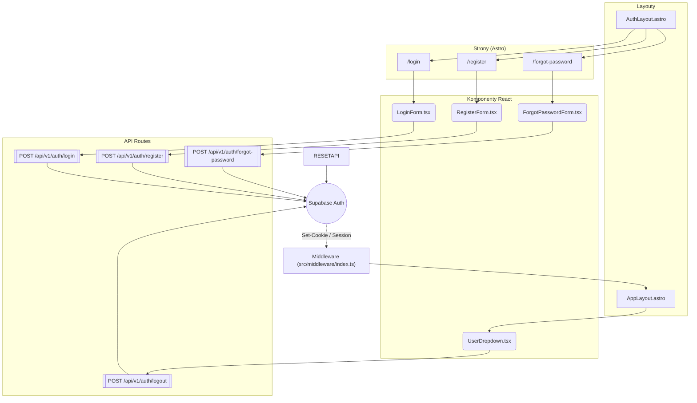

<architecture_analysis>

1. Komponenty znalezione w kodzie i dokumentacji:
   • Layouty: AuthLayout.astro, Layout.astro (pełni rolę AppLayout).  
   • Strony Astro: /login.astro, /register.astro, /forgot-password.astro.  
   • Komponenty React (formularze): LoginForm.tsx, RegisterForm.tsx, ForgotPasswordForm.tsx, ResetPasswordForm.tsx (planowany).  
   • Komponent nawigacyjny: UserDropdown.tsx.  
   • Middleware: src/middleware/index.ts (kontrola dostępu).  
   • Walidatory Zod: auth.ts (LoginSchema, RegisterSchema, ForgotPasswordSchema, ResetPasswordSchema).  
   • Endpointy API: /api/v1/auth/{login, register, forgot-password, reset-password, logout}.ts.  
   • Supabase klient serwerowy: src/db/supabase/server.ts.

2. Główne strony i odpowiadające im komponenty:
   • /login – AuthLayout + LoginForm.  
   • /register – AuthLayout + RegisterForm.  
   • /forgot-password – AuthLayout + ForgotPasswordForm.  
   • Widoki po zalogowaniu wykorzystują Layout.astro (AppLayout) + UserDropdown.

3. Przepływ danych (happy-path):
   a) Użytkownik wypełnia formularz React.  
   b) Formularz wysyła żądanie POST do trasy API.  
   c) Trasa API wywołuje Supabase Auth.  
   d) Supabase ustawia ciasteczka `Set-Cookie` i zwraca status.  
   e) Przeglądarka zapisuje ciasteczka; kolejne żądania przechodzą przez Middleware, które odczytuje sesję i udostępnia `locals.user`.  
   f) Middleware przekierowuje pomiędzy Layoutami (AuthLayout ↔ AppLayout).  
   g) W AppLayout komponent UserDropdown pozwala na `logout` (POST /logout → Supabase).

4. Opis funkcjonalności kluczowych elementów:
   • AuthLayout – minimalistyczny layout dla publicznych stron, renderuje logo + slot.  
    • Layout.astro (AppLayout) – layout prywatny, renderuje nagłówek z UserDropdown i gniazdo na zawartość.  
    • Formularze – zarządzają stanem i walidacją danych, obsługują wysyłkę do API.  
    • Middleware – ochrona tras, weryfikacja sesji, przekierowania.  
    • API routes – warstwa backendowa, waliduje dane, komunikuje się z Supabase.  
    • Supabase – zewnętrzna usługa zarządzająca sesją i danymi użytkowników.
   </architecture_analysis>

<mermaid_diagram>

</mermaid_diagram>
