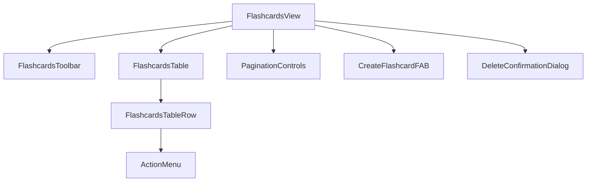

# Plan implementacji widoku: Lista Fiszke

## 1. Przegląd

Widok "Lista Fiszke" stanowi centrum zarządzania kolekcją fiszek użytkownika. Umożliwia on przeglądanie wszystkich posiadanych fiszek, filtrowanie ich, a także wykonywanie masowych operacji, takich jak usuwanie. Widok ten jest kluczowy dla nawigacji i utrzymania porządku w materiałach do nauki, realizując historyjki użytkownika dotyczące zarządzania fiszkami (US-007, US-010).

## 2. Routing widoku

Widok będzie dostępny pod następującą ścieżką routingu:

- `/flashcards`

## 3. Struktura komponentów

Hierarchia komponentów została zaprojektowana w celu zapewnienia czytelności i reużywalności. Główny komponent `FlashcardsView` orkiestruje stanem i danymi, delegując renderowanie do wyspecjalizowanych komponentów podrzędnych.



- **`FlashcardsView` (Page)**: Główny kontener widoku, odpowiedzialny za pobieranie danych, zarządzanie stanem zaznaczenia, filtrowania oraz obsługę logiki biznesowej za pomocą hooka `useFlashcards`.
- **`FlashcardsToolbar`**: Pasek narzędzi umieszczony nad tabelą, zawierający filtry (np. po źródle fiszki) oraz przyciski akcji masowych (np. "Usuń zaznaczone").
- **`FlashcardsTable`**: Komponent tabeli (`shadcn/ui`) wyświetlający listę fiszek. Zarządza nagłówkami tabeli, w tym głównym polem wyboru "Zaznacz wszystko".
- **`FlashcardsTableRow`**: Reprezentuje pojedynczy wiersz w tabeli. Zawiera checkbox do zaznaczenia, dane fiszki oraz menu akcji (`DropdownMenu`) dla pojedynczego elementu.
- **`PaginationControls`**: Komponent do nawigacji między stronami listy fiszek.
- **`CreateFlashcardFAB`**: Pływający przycisk akcji (FAB), który przekierowuje użytkownika na stronę tworzenia nowej fiszki (`/flashcards/new`).
- **`DeleteConfirmationDialog`**: Modalne okno dialogowe (`AlertDialog` z `shadcn/ui`) proszące o potwierdzenie przed wykonaniem operacji usunięcia (pojedynczego lub masowego).

## 4. Szczegóły komponentów

### `FlashcardsView` (Page)

- **Opis**: Komponent-strona, który integruje wszystkie elementy widoku listy fiszek. Orkiestruje przepływem danych z API do komponentów UI przy użyciu customowego hooka `useFlashcards`. Zarządza stanem, który nie jest bezpośrednio związany z serwerem, takim jak lista zaznaczonych ID fiszek.
- **Główne elementy**: Kontener `div` opakowujący `FlashcardsToolbar`, `FlashcardsTable`, `PaginationControls`, `CreateFlashcardFAB`, `DeleteConfirmationDialog`.
- **Obsługiwane interakcje**: Brak bezpośrednich. Logika delegowana do hooka `useFlashcards` i obsługa stanu lokalnego.
- **Typy**: `Set<number>` dla `selectedIds`.
- **Propsy**: Brak.

### `FlashcardsToolbar`

- **Opis**: Pasek narzędzi pozwalający na interakcję z całą listą fiszek. Umożliwia filtrowanie wyników i wykonywanie akcji na zaznaczonych elementach.
- **Główne elementy**: `<DropdownMenu>` do filtrowania, `<Button>` do akcji masowych. Komponenty z `shadcn/ui`.
- **Obsługiwane interakcje**:
  - Zmiana filtra: wywołuje funkcję `setFilters` z `useFlashcards`.
  - Kliknięcie "Usuń zaznaczone": otwiera `DeleteConfirmationDialog`.
- **Warunki walidacji**: Przycisk "Usuń zaznaczone" jest nieaktywny, jeśli żadna fiszka nie jest zaznaczona (`selectedIds.size === 0`) lub gdy operacja usuwania jest w toku.
- **Typy**: Brak specyficznych.
- **Propsy**:
  - `selectedCount: number`
  - `onDeleteSelected: () => void`
  - `isDeleting: boolean`
  - `filters: FlashcardFilters`
  - `onFiltersChange: (newFilters: FlashcardFilters) => void`

### `FlashcardsTable`

- **Opis**: Wyświetla dane fiszek w formie tabelarycznej. Odpowiada za renderowanie nagłówków oraz wierszy na podstawie otrzymanych danych.
- **Główne elementy**: `<Table>`, `<TableHeader>`, `<TableBody>` z `shadcn/ui`. Renderuje listę komponentów `FlashcardsTableRow`.
- **Obsługiwane interakcje**:
  - Kliknięcie "Zaznacz wszystko": zaznacza lub odznacza wszystkie widoczne fiszki.
- **Warunki walidacji**: Brak.
- **Typy**: `Flashcard[]`.
- **Propsy**:
  - `flashcards: Flashcard[]`
  - `selectedIds: Set<number>`
  - `onToggleSelectAll: (isSelected: boolean) => void`
  - `onToggleSelectRow: (id: number) => void`
  - `onDelete: (id: number) => void`
  - `isLoading: boolean`

### `FlashcardsTableRow`

- **Opis**: Reprezentuje pojedynczą fiszkę w tabeli. Wyświetla jej kluczowe dane oraz udostępnia menu dla akcji specyficznych dla danego wiersza.
- **Główne elementy**: `<TableRow>`, `<TableCell>`, `<Checkbox>`, `<DropdownMenu>` z `shadcn/ui`.
- **Obsługiwane interakcje**:
  - Zaznaczenie checkboxa: wywołuje `onToggleSelectRow`.
  - Wybranie opcji "Edytuj" z menu: przekierowuje do `/flashcards/:id/edit`.
  - Wybranie opcji "Usuń" z menu: wywołuje `onDelete` po potwierdzeniu.
- **Warunki walidacji**: Brak.
- **Typy**: `Flashcard`.
- **Propsy**:
  - `flashcard: Flashcard`
  - `isSelected: boolean`
  - `onToggleSelect: () => void`
  - `onDelete: () => void`

## 5. Typy

Implementacja będzie bazować na istniejącym DTO. Nie ma potrzeby tworzenia dedykowanych typów ViewModel, ponieważ stan zaznaczenia można efektywnie zarządzać za pomocą zbioru ID.

### DTO (Data Transfer Objects) - z `src/types.ts`

- **`Flashcard`**: Podstawowy obiekt fiszki pobierany z API.
  ```typescript
  interface Flashcard {
    id: number;
    front: string;
    back: string;
    source: 'manual' | 'ai-full' | 'ai-edited';
    generationId: string | null;
    createdAt: string; // ISO 8601
    updatedAt: string; // ISO 8601
  }
  ```

## 6. Zarządzanie stanem

Stan serwera (fiszki, paginacja, statusy ładowania i błędów) będzie zarządzany przy użyciu biblioteki **TanStack Query (`@tanstack/react-query`)**. Logika ta zostanie zamknięta w customowym hooku `useFlashcards`. Stan UI (np. zaznaczone wiersze) będzie zarządzany lokalnie w komponencie `FlashcardsView` za pomocą hooka `useState`.

### `useFlashcards` (Custom Hook)

- **Cel**: Hermetyzacja logiki komunikacji z API `/api/v1/flashcards`. Zarządzanie stanem serwera, w tym pobieraniem danych, paginacją, filtrowaniem, sortowaniem oraz mutacjami (usuwanie).
- **Wykorzystanie**: `useQuery` do pobierania danych, `useMutation` do operacji usuwania.
- **Wyeksponowane wartości**:
  - `data: { flashcards: Flashcard[], total: number } | undefined`
  - `isLoading: boolean`
  - `isError: boolean`
  - `page`, `setPage`
  - `filters`, `setFilters`
  - `deleteMutation: UseMutationResult<void, Error, number>`
  - `bulkDeleteMutation: UseMutationResult<void, Error, number[]>`

### Stan w `FlashcardsView`

- `const [selectedIds, setSelectedIds] = useState<Set<number>>(new Set())`: Do zarządzania zbioru ID zaznaczonych fiszek.
- Stan do zarządzania widocznością `DeleteConfirmationDialog`.

## 7. Integracja API

### 1. Pobieranie listy fiszek

- **Endpoint**: `GET /api/v1/flashcards`
- **Parametry**: `page`, `limit`, `sort`, `order`, `query` (dla filtrowania).
- **Obsługa**: Wywoływane przez `useQuery` w hooku `useFlashcards`. Zapytanie jest automatycznie ponawiane przy zmianie zależności (strona, filtry).
- **Odpowiedź (Sukces)**: `{ flashcards: Flashcard[], total: number }`

### 2. Usuwanie fiszek

- **Endpoint**: `DELETE /api/v1/flashcards/:id`
- **Obsługa**:
  - **Pojedyncze usunięcie**: Wywoływane przez `deleteMutation.mutate(id)`.
  - **Masowe usunięcie**: Brak dedykowanego endpointu API. Implementacja po stronie klienta w `bulkDeleteMutation`, która wywołuje `Promise.allSettled` na wielu zapytaniach `DELETE`.
- **Odpowiedź (Sukces)**: `204 No Content`.
- **Akcje po sukcesie**: `useMutation` automatycznie unieważni zapytanie (`queryKey`) dla listy fiszek, co spowoduje ponowne pobranie aktualnych danych i odświeżenie widoku.

## 8. Interakcje użytkownika

1.  **Ładowanie widoku**: Użytkownik przechodzi do `/flashcards`. Wyświetlany jest szkielet tabeli (`loading skeleton`), a hook `useFlashcards` pobiera pierwszą stronę danych.
2.  **Zaznaczanie**: Użytkownik klika na `Checkbox`. Stan `selectedIds` jest aktualizowany, a przycisk "Usuń zaznaczone" staje się aktywny.
3.  **Filtrowanie/Sortowanie**: Użytkownik zmienia wartość w filtrze. Hook `useFlashcards` pobiera nową listę danych z odpowiednimi parametrami.
4.  **Nawigacja**: Użytkownik klika na przycisk paginacji, co powoduje pobranie danych dla nowej strony.
5.  **Usuwanie masowe**: Użytkownik klika "Usuń zaznaczone". Pojawia się okno dialogowe. Po potwierdzeniu, `bulkDeleteMutation` jest wywoływane. Przycisk pokazuje stan ładowania. Po zakończeniu lista odświeża się, a użytkownik otrzymuje powiadomienie (toast).
6.  **Tworzenie nowej**: Użytkownik klika na FAB, co przenosi go na stronę `/flashcards/new`.

## 9. Warunki i walidacja

- **Przycisk akcji masowych**: Przycisk "Usuń zaznaczone" w `FlashcardsToolbar` jest aktywny (`disabled={false}`) tylko wtedy, gdy `selectedIds.size > 0` i operacja usuwania nie jest w toku.
- **Interaktywność**: Wszystkie elementy interaktywne (przyciski, filtry) powinny być zablokowane na czas początkowego ładowania danych, aby zapobiec niespójności stanu.

## 10. Obsługa błędów

- **Błąd pobierania danych (sieciowy lub serwera)**: `useQuery` ustawi `isError` na `true`. `FlashcardsView` wyświetli komunikat błędu z przyciskiem "Spróbuj ponownie".
- **Błąd operacji usuwania**: `useMutation` ustawi `isError` na `true`. Użytkownik zostanie poinformowany o niepowodzeniu za pomocą globalnego powiadomienia (toast), np. z biblioteki `sonner`.
- **Częściowe niepowodzenie przy usuwaniu masowym**: Dzięki `Promise.allSettled`, użytkownik otrzyma informację zwrotną o tym, które fiszki udało się usunąć, a które nie.
- **Brak autoryzacji (401)**: Globalny klient API powinien przechwycić ten błąd i automatycznie przekierować użytkownika na stronę logowania `/auth`.

## 11. Kroki implementacji

1.  Utworzenie pliku strony `src/pages/flashcards/index.astro`.
2.  Utworzenie głównego komponentu React `src/components/views/FlashcardsView.tsx` i osadzenie go jako "wyspy" w pliku Astro.
3.  Implementacja customowego hooka `useFlashcards` w `src/lib/hooks/useFlashcards.ts` z wykorzystaniem `@tanstack/react-query`.
4.  Stworzenie komponentów `FlashcardsToolbar`, `FlashcardsTable` i `FlashcardsTableRow` z użyciem komponentów `shadcn/ui`.
5.  Implementacja logiki zaznaczania pojedynczych wierszy oraz "Zaznacz wszystko" w `FlashcardsView`.
6.  Stworzenie i integracja komponentów `PaginationControls`, `CreateFlashcardFAB` oraz `DeleteConfirmationDialog`.
7.  Implementacja logiki usuwania pojedynczego oraz masowego w hooku `useFlashcards` i podpięcie jej do komponentów UI.
8.  Dodanie obsługi stanów ładowania (np. `skeleton placeholders`) i błędów.
9.  Implementacja powiadomień (toast) dla operacji zakończonych sukcesem lub błędem.
10. Zapewnienie responsywności tabeli na urządzeniach mobilnych (poziomy scroll).
11. Testowanie manualne wszystkich ścieżek użytkownika, w tym filtrowania, paginacji, usuwania i obsługi błędów.
