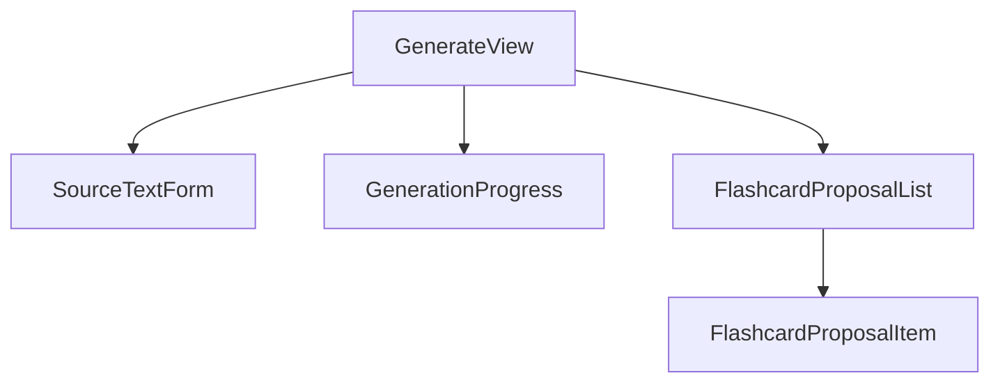

# Plan implementacji widoku: Generator AI

## 1. Przegląd

Widok "Generator AI" umożliwia użytkownikom generowanie propozycji fiszek na podstawie dostarczonego tekstu źródłowego przy użyciu sztucznej inteligencji. Użytkownik może wprowadzić tekst, zainicjować proces generowania, a następnie przeglądać, edytować i zapisywać wybrane fiszki. Widok ten stanowi kluczowy element aplikacji, automatyzując proces tworzenia materiałów do nauki i realizując główne założenia produktu opisane w PRD.

## 2. Routing widoku

Widok będzie dostępny pod następującą ścieżką routingu:

- `/generate`

## 3. Struktura komponentów

Hierarchia komponentów dla widoku została zaprojektowana w celu separacji odpowiedzialności i reużywalności.



- **`GenerateView` (Page)**: Główny kontener widoku, zarządzający stanem i logiką.
- **`SourceTextForm`**: Formularz do wprowadzania tekstu źródłowego.
- **`GenerationProgress`**: Komponent wyświetlający status procesu generowania (pasek postępu, komunikaty).
- **`FlashcardProposalList`**: Komponent wyświetlający listę wygenerowanych propozycji fiszek i zawierający główną akcję masowego zapisu.
- **`FlashcardProposalItem`**: Pojedynczy element na liście propozycji, umożliwiający edycję i zaznaczenie.

## 4. Szczegóły komponentów

### `GenerateView` (Page)

- **Opis**: Komponent-strona, który orkiestruje cały proces generowania fiszek. Zarządza stanem globalnym widoku, obsługuje wywołania API za pośrednictwem customowego hooka `useGeneration` i renderuje odpowiednie komponenty podrzędne w zależności od aktualnego etapu procesu (wprowadzanie tekstu, ładowanie, wyświetlanie wyników).
- **Główne elementy**: Kontener `div` opakowujący komponenty `SourceTextForm`, `GenerationProgress` oraz `FlashcardProposalList`.
- **Obsługiwane interakcje**: Brak bezpośrednich. Logika jest delegowana do hooka `useGeneration`.
- **Typy**: `ProposalState[]`.
- **Propsy**: Brak.

### `SourceTextForm`

- **Opis**: Odpowiedzialny za zbieranie od użytkownika tekstu źródłowego. Składa się z pola tekstowego (`textarea`) oraz przycisku do uruchomienia generowania.
- **Główne elementy**: `<form>`, `<textarea>`, `<Button>`. Komponenty z biblioteki `shadcn/ui`.
- **Obsługiwane interakcje**:
  - `onSubmit` formularza: wywołuje funkcję `onGenerate` przekazaną w propsach.
  - Zmiana tekstu w `textarea`.
- **Warunki walidacji**:
  - `sourceText` musi mieć długość od 1000 do 10 000 znaków. Przycisk "Generuj" jest nieaktywny, jeśli warunek nie jest spełniony. Wyświetlany jest licznik znaków.
- **Typy**: Brak specyficznych.
- **Propsy**:
  - `onGenerate: (sourceText: string) => void`
  - `isLoading: boolean` (do blokowania formularza w trakcie generowania)

### `GenerationProgress`

- **Opis**: Informuje użytkownika o statusie długotrwałej operacji generowania fiszek. Wyświetla pasek postępu, komunikat o statusie oraz przycisk do anulowania operacji.
- **Główne elementy**: `<ProgressBar>`, `<p>`, `<Button variant="destructive">`. Komponenty z `shadcn/ui`.
- **Obsługiwane interakcje**:
  - Kliknięcie przycisku "Anuluj": wywołuje funkcję `onCancel` z propsów.
- **Warunki walidacji**: Brak.
- **Typy**: Brak.
- **Propsy**:
  - `status: 'loading' | 'error'`
  - `onCancel: () => void`
  - `onRetry: () => void`

### `FlashcardProposalList`

- **Opis**: Wyświetla listę propozycji fiszek zwróconych przez AI. Umożliwia zaznaczenie wszystkich, edycję każdej z osobna oraz **masowe zapisywanie wybranych propozycji za pomocą dedykowanego przycisku "Zapisz wybrane"**.
- **Główne elementy**: `div` z listą komponentów `FlashcardProposalItem`, `Checkbox` ("Zaznacz wszystkie"), oraz główny przycisk akcji `<Button>` (`shadcn/ui`) do masowego zapisu.
- **Obsługiwane interakcje**:
  - **Kliknięcie przycisku "Zapisz wybrane"**: Uruchamia proces masowego zapisu. Wywołuje funkcję `onSave` przekazaną w `props`. Logika filtrowania zaznaczonych i poprawnych fiszek znajduje się w komponencie nadrzędnym (`GenerateView`).
  - Zmiana stanu "Zaznacz wszystkie": aktualizuje stan `isSelected` dla wszystkich propozycji.
- **Warunki walidacji**:
  - **Przycisk "Zapisz wybrane" jest nieaktywny**, jeśli:
    - Żadna fiszka nie jest zaznaczona.
    - Którakolwiek z zaznaczonych fiszek zawiera niepoprawne dane (`proposal.isValid === false`).
    - Trwa już proces zapisu (`isSaving` jest `true`).
- **Typy**: `ProposalState[]`.
- **Propsy**:
  - `proposals: ProposalState[]`
  - `onUpdateProposal: (id: string, newFront: string, newBack: string) => void`
  - `onToggleSelectProposal: (id: string, isSelected: boolean) => void`
  - `onToggleSelectAll: (isSelected: boolean) => void`
  - `onSave: () => void`
  - `isSaving: boolean`

### `FlashcardProposalItem`

- **Opis**: Reprezentuje pojedynczą propozycję fiszki na liście. Wyświetla jej przód i tył, pozwala na jej zaznaczenie oraz edycję w miejscu.
- **Główne elementy**: `<Card>`, `<Checkbox>`, `<Input>`/`<Textarea>` do edycji.
- **Obsługiwane interakcje**:
  - Zaznaczenie checkboxa: wywołuje `onToggleSelect`.
  - Zmiana tekstu w polach edycji: wywołuje `onUpdate`.
- **Warunki walidacji**:
  - `front`: max 200 znaków.
  - `back`: max 500 znaków.
  - W przypadku błędu walidacji, pole jest oznaczane na czerwono, a przycisk zapisu w komponencie nadrzędnym jest blokowany.
- **Typy**: `ProposalState`.
- **Propsy**:
  - `proposal: ProposalState`
  - `onUpdate: (newFront: string, newBack: string) => void`
  - `onToggleSelect: (isSelected: boolean) => void`

## 5. Typy

Do implementacji widoku wykorzystane zostaną istniejące DTO oraz nowy typ ViewModel do zarządzania stanem UI.

### DTO (Data Transfer Objects) - z `src/types.ts`

- **`GenerateFlashcardsCommand`**: Obiekt wysyłany do `/api/v1/generations`.
  ```typescript
  { sourceText: string; model?: string; }
  ```
- **`GenerateFlashcardsResponse`**: Odpowiedź z `/api/v1/generations`.
  ```typescript
  { flashcards: FlashcardProposal[]; metadata: { model: string; generation_time: string; }; }
  ```
- **`CreateFlashcardsBulkRequest`**: Obiekt wysyłany do `/api/v1/flashcards`.
  ```typescript
  { flashcards: FlashcardProposal[]; }
  ```
- **`FlashcardProposal`**: Podstawowy obiekt fiszki.
  ```typescript
  { front: string; back: string; source?: 'manual' | 'ai-full' | 'ai-edited'; }
  ```

### ViewModel

- **`ProposalState`**: Typ reprezentujący stan pojedynczej propozycji fiszki w interfejsie użytkownika.
  ```typescript
  interface ProposalState {
    id: string; // Unikalny identyfikator po stronie klienta (np. uuidv4)
    original: FlashcardProposal; // Oryginalna propozycja z API
    current: FlashcardProposal; // Aktualna treść po edycji przez użytkownika
    isSelected: boolean; // Czy propozycja jest zaznaczona do zapisu
    isValid: boolean; // Czy aktualna treść jest zgodna z walidacją
  }
  ```

## 6. Zarządzanie stanem

Stan widoku będzie zarządzany w komponencie `GenerateView` z wykorzystaniem hooka `useReducer` do obsługi złożonej logiki stanu propozycji fiszek. Logika komunikacji z API zostanie wyabstrahowana do customowego hooka `useGeneration`.

### `useGeneration` (Custom Hook)

- **Cel**: Hermetyzacja logiki zapytań API (generowanie i zapisywanie), zarządzanie stanami ładowania, błędów oraz anulowania zapytań.
- **Wyeksponowane wartości**:
  - `generationState: 'idle' | 'loading' | 'success' | 'error'`
  - `saveState: 'idle' | 'loading' | 'success' | 'error'`
  - `proposals: GenerateFlashcardsResponse['flashcards'] | null`
  - `error: string | null`
  - `generate: (cmd: GenerateFlashcardsCommand) => Promise<void>`
  - `save: (cmd: CreateFlashcardsBulkRequest) => Promise<void>`
  - `cancelGeneration: () => void`

### Stan w `GenerateView`

- `const [proposalsState, dispatch] = useReducer(proposalsReducer, [])`: Do zarządzania tablicą `ProposalState`. Reducer będzie obsługiwał akcje takie jak `INITIALIZE`, `UPDATE_TEXT`, `TOGGLE_SELECT`, `TOGGLE_SELECT_ALL`.

## 7. Integracja API

### 1. Generowanie Fiszke

- **Endpoint**: `POST /api/v1/generations`
- **Żądanie**: `GenerateFlashcardsCommand`
- **Odpowiedź (Sukces)**: `201 Created` z `GenerateFlashcardsResponse`
- **Obsługa**: Wywoływane przez `useGeneration.generate()`. Po otrzymaniu odpowiedzi, stan `proposalsState` w `GenerateView` jest inicjowany na podstawie otrzymanych danych.

### 2. Zapisywanie Fiszke

- **Endpoint**: `POST /api/v1/flashcards`
- **Żądanie**: `CreateFlashcardsBulkRequest`
- **Odpowiedź (Sukces)**: `201 Created` z zapisanymi fiszkami.
- **Obsługa**: Wywoływane przez `useGeneration.save()`. Przed wywołaniem, `proposalsState` jest filtrowany, aby wybrać zaznaczone i poprawne fiszki. Dla edytowanych fiszek `source` jest ustawiany na `'ai-edited'`. Po sukcesie, następuje przekierowanie do `/flashcards`.

## 8. Interakcje użytkownika

1.  **Wprowadzanie tekstu**: Użytkownik wpisuje tekst w `SourceTextForm`. Licznik znaków i stan przycisku "Generuj" aktualizują się na bieżąco.
2.  **Inicjowanie generowania**: Kliknięcie "Generuj" blokuje formularz i wyświetla `GenerationProgress`.
3.  **Anulowanie**: Kliknięcie "Anuluj" w `GenerationProgress` przerywa zapytanie API i przywraca widok do stanu początkowego.
4.  **Przeglądanie propozycji**: Po pomyślnym wygenerowaniu, `FlashcardProposalList` wyświetla listę fiszek.
5.  **Edycja i zaznaczanie**: Użytkownik może edytować treść każdej fiszki w `FlashcardProposalItem` i zaznaczać je do zapisu. Stan `isSelected` i `current` w `ProposalState` jest aktualizowany.
6.  **Zapisywanie**: Kliknięcie "Zapisz wybrane" wysyła zaznaczone fiszki do API. Przycisk jest zablokowany podczas operacji.
7.  **Zakończenie**: Po pomyślnym zapisie, użytkownik widzi komunikat (toast) i zostaje przekierowany na stronę `/flashcards`.

## 9. Warunki i walidacja

- **Długość tekstu źródłowego**: Weryfikowana w `SourceTextForm`. Przycisk "Generuj" jest nieaktywny, jeśli `sourceText.length` nie mieści się w przedziale [1000, 10000].
- **Długość treści fiszki**: Weryfikowana w `FlashcardProposalItem` podczas edycji.
  - `front`: `length > 0 && length <= 200`
  - `back`: `length > 0 && length <= 500`
- **Warunek zapisu**: Przycisk "Zapisz wybrane" w `FlashcardProposalList` jest aktywny tylko, jeśli `proposalsState.some(p => p.isSelected && p.isValid)`.

## 10. Obsługa błędów

- **Błąd walidacji (400) z `/generations`**: Mimo walidacji po stronie klienta, w razie błędu serwera, `SourceTextForm` wyświetli komunikat błędu zwrócony z API.
- **Błąd serwera (5xx)**: Hook `useGeneration` ustawi `generationState` lub `saveState` na `'error'` i przechowa komunikat błędu. Komponent `GenerationProgress` wyświetli błąd i przycisk "Spróbuj ponownie". W przypadku błędu zapisu, wyświetlony zostanie globalny toast z błędem.
- **Błąd sieci**: `fetch` rzuci wyjątek, który zostanie przechwycony przez hook. Użytkownik zobaczy ogólny komunikat o problemie z połączeniem.
- **Brak autoryzacji (401)**: Globalny mechanizm obsługi zapytań (np. w kliencie API) powinien przechwycić ten błąd i przekierować użytkownika na stronę logowania `/auth`.

## 11. Kroki implementacji

1.  Utworzenie pliku strony `src/pages/generate.astro` i komponentu React `src/components/views/GenerateView.tsx`.
2.  Implementacja customowego hooka `useGeneration` w `src/lib/hooks/useGeneration.ts`, zawierającego logikę zapytań API, stany ładowania/błędów i anulowanie.
3.  Stworzenie komponentu `SourceTextForm` z walidacją i stanem `disabled`.
4.  Stworzenie komponentu `GenerationProgress` z obsługą stanów `loading` i `error`.
5.  Implementacja `FlashcardProposalList` oraz `FlashcardProposalItem`.
6.  Zdefiniowanie typu `ProposalState` i implementacja `proposalsReducer` w `GenerateView`.
7.  Połączenie wszystkich komponentów w `GenerateView`, zarządzanie stanem za pomocą `useReducer` i integracja z hookiem `useGeneration`.
8.  Implementacja logiki przekierowania po pomyślnym zapisie (`Astro.redirect` lub hook z biblioteki routingu).
9.  Dodanie powiadomień typu toast dla operacji zapisu i błędów.
10. Testowanie manualne wszystkich ścieżek użytkownika, w tym przypadków brzegowych i obsługi błędów.
